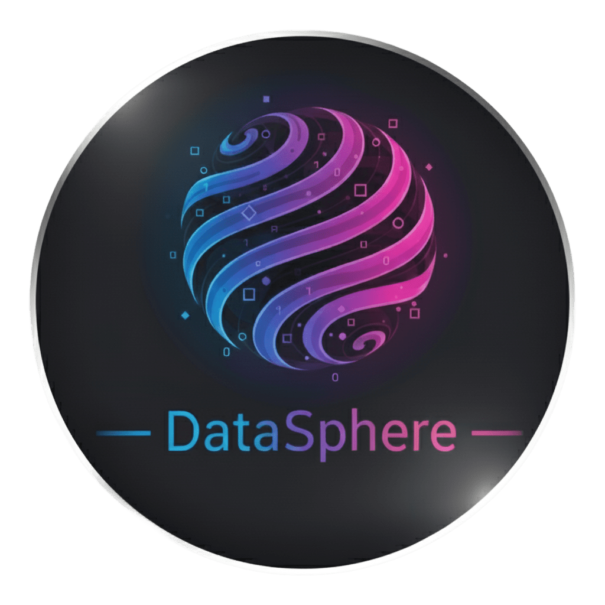

  
  <h2 align="center"> Datasphere </h2>

# Manual do Usuário

Este documento descreve como utilizar o *Datasphere* no dia a dia. O sistema permite o gerenciamento de espelhos e faturas relacionados ao processo de faturamento do FUSEx.

Por meio do sistema, o usuário pode cadastrar novos espelhos a partir de atendimentos realizados, informar os itens utilizados, consultar espelhos cadastrados e acompanhar as faturas geradas.

As principais funcionalidades disponíveis no sistema são:

- *Espelhos* — permite consultar os espelhos cadastrados e criar novos espelhos;
- *Faturas* — permite consultar as faturas geradas e realizar a regeração de uma fatura quando necessário.

---

# 📄 Espelhos

A funcionalidade de *Espelhos* permite acompanhar os espelhos cadastrados e criar novos espelhos a partir de atendimentos realizados.

Ao acessar a tela de *Espelhos*, o sistema apresenta uma listagem com os espelhos cadastrados.

Para cada espelho, podem ser apresentadas informações como:

- OCS;
- Período do atendimento;
- Status do espelho;
- Outras informações disponíveis no cadastro.

---

## 📋 Visualizar um espelho

Para consultar um espelho:

1. Acesse a opção *Espelhos*;
2. Localize o espelho desejado na listagem;
3. Clique na opção de *Visualizar*;
4. Consulte as informações apresentadas.

A visualização permite consultar os dados disponíveis do espelho selecionado.

> Algumas informações e ações relacionadas ao detalhamento do espelho podem depender das funcionalidades disponibilizadas no sistema.

---

## ➕ Criar um novo espelho

Para criar um novo espelho:

1. Acesse a tela *Espelhos*;
2. Clique no botão *+ Novo espelho*;
3. Informe o *ID do atendimento*;
4. Informe o *CNPJ da OCS*;
5. Adicione os itens utilizados no atendimento;
6. Confira as informações preenchidas;
7. Clique em *Criar espelho*.

Após o cadastro, o sistema realizará o envio das informações e o novo espelho ficará disponível na listagem.

> O ID do atendimento e o CNPJ da OCS são informações obrigatórias para o cadastro do espelho.

---

## 📋 Informar os itens do espelho

Durante a criação de um espelho, é necessário informar os itens relacionados ao atendimento.

Para cada item devem ser preenchidas as seguintes informações:

- *Beneficiário (PrecCP)*;
- *Descrição*;
- *Valor*.

Para adicionar um item:

1. Acesse a seção *Itens do espelho*;
2. Preencha o campo *Beneficiário (PrecCP)*;
3. Informe a *Descrição* do item;
4. Informe o *Valor* correspondente;
5. Caso seja necessário adicionar outro item, clique em *+ Adicionar item*;
6. Repita o procedimento para os demais itens.

---

## ➕ Adicionar um item

É possível adicionar vários itens ao mesmo espelho.

Para adicionar um novo item:

1. Na seção *Itens do espelho*, clique em *+ Adicionar item*;
2. Será apresentada uma nova linha para preenchimento;
3. Informe o beneficiário;
4. Informe a descrição;
5. Informe o valor;
6. Continue adicionando os itens necessários.

---

## 🗑️ Remover um item

Caso um item tenha sido adicionado incorretamente, é possível removê-lo antes da criação do espelho.

Para remover um item:

1. Localize o item que deseja remover;
2. Clique no botão *Remover*;
3. O item será retirado da lista.

O sistema mantém pelo menos um item no formulário. Dessa forma, o último item não pode ser removido.

> Confira os itens cadastrados antes de criar o espelho.

---

## ❌ Cancelar a criação

Caso o usuário não queira continuar com o cadastro:

1. Na tela de criação do espelho, clique em *Cancelar*;
2. O sistema retornará para a tela de *Espelhos*.

Também é possível utilizar a opção *← Voltar* localizada no início da página.

---

# 🧾 Faturas

A funcionalidade de *Faturas* permite acompanhar as faturas geradas pelo sistema e consultar seus detalhes.

Ao acessar a tela de *Faturas*, o sistema apresenta uma listagem contendo as faturas disponíveis.

Para cada fatura, podem ser apresentadas informações como:

- OCS;
- Data de geração;
- Status da fatura;
- Outras informações disponíveis no cadastro.

---

## 👁️ Visualizar uma fatura

Para consultar uma fatura:

1. Acesse a opção *Faturas*;
2. Localize a fatura desejada;
3. Clique na opção de *Visualizar*;
4. Consulte os detalhes apresentados.

---

## 🔄 Regerar uma fatura

O sistema permite realizar a regeração de uma fatura quando essa ação estiver disponível.

Para regerar uma fatura:

1. Acesse a opção *Faturas*;
2. Localize a fatura desejada;
3. Clique em *Visualizar*;
4. Acesse os detalhes da fatura;
5. Selecione a opção *Regerar*;
6. Aguarde o processamento da operação.

Após a regeração:

- A fatura anterior será identificada como *Regerada*;
- Uma nova fatura será adicionada à listagem;
- A nova fatura poderá ser consultada normalmente.

> A regeração deve ser realizada somente quando houver necessidade de gerar uma nova versão da fatura.

---

# 💡 Dicas de Utilização

- Confira o ID do atendimento antes de criar um espelho.
- Verifique se o CNPJ da OCS foi informado corretamente.
- Confira os dados do beneficiário antes de adicionar cada item.
- Revise a descrição e o valor de cada item antes de criar o espelho.
- Utilize o botão *+ Adicionar item* para incluir todos os itens necessários.
- Remova os itens cadastrados incorretamente antes de criar o espelho.
- Confira os dados do espelho após sua criação.
- Na tela de faturas, verifique a data e o status antes de realizar uma operação.
- Utilize a opção de regeração somente quando for necessário gerar uma nova versão da fatura.