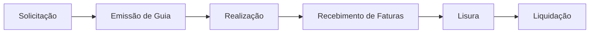
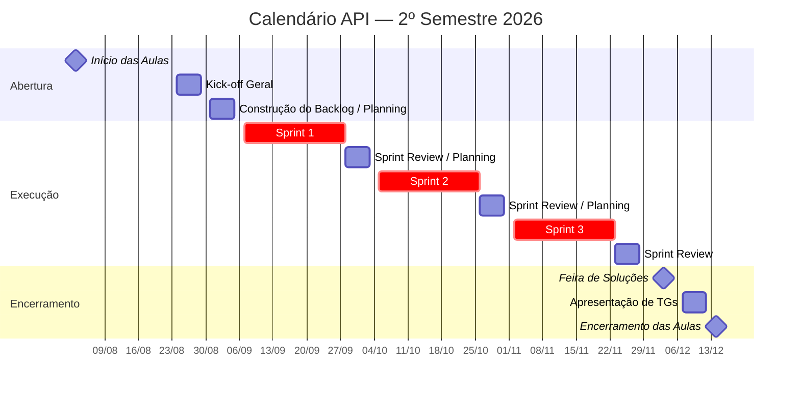

# FUSEX - 
<p align="center">
  
</p>
<p align="center">
    <a href = #sobre>
    <a href ="#desafio"> Desafio</a> |
    <a href ="#solução"> Solução</a> |
    <a href ="#backlog"> Backlog do Produto</a> |   
    <a href ="#sprints"> Cronograma das Sprints</a> |
    <a href ="#estrutura"> Estrutura do Projeto</a> |
    <a href ="#documentacao"> Documentação </a> |
    <a href ="#tecnologias"> Tecnologias</a> |
    <a href ="#equipe"> Equipe </a> |


</p>

### Sobre o Projeto <a id="sobre"></a>

O aplicativo da FUSEX é um projeto desenvolvido por alunos do 3º semestre do curso de Banco de Dados da FATEC, em parceria com o Exército Brasileiro (FUSEx), como parte de um Projeto Integrador.
O objetivo da aplicação é gerenciar as guias emitidas para os beneficiários, desde sua criação até as etapas de atendimento, faturamento e aprovação para pagamento. A solução busca reduzir erros, economizar tempo e automatizar tarefas, tornando o processo mais eficiente e organizado.

---

> Status do projeto: Em andamento


## 🎯 Descrição do Desafio

**Parceiro:** Exército — Guarnição de Caçapava
**Ponto Focal:** Ricardo Botan
**Professor M2:** Lucas Nadalete
**Professor P2:** Juliana Pasquini

**Problema, em uma frase:**
Facilitar a integração na comunicação e trâmite documental entre a UG FUSEx (Exército) e as OCS/PSA (clínicas, hospitais e profissionais da área de saúde).

**A dor do parceiro:**
Hoje, o processo de emissão, utilização e faturamento das guias médicas depende fortemente de trabalho manual, sujeito a erros de preenchimento e à falta de rastreabilidade entre as etapas. Não existe uma cadeia única de informação que acompanhe o pedido médico desde a solicitação até o faturamento — cada etapa (solicitação, emissão de guia, atendimento, faturamento, auditoria) pode exigir consultas e lançamentos manuais separados, o que gera inconsistências, lentidão e retrabalho tanto para o Exército quanto para as clínicas credenciadas (OCS/PSA).

O objetivo do sistema não é apenas digitalizar mais uma etapa isolada, mas **integrar toda a cadeia**:

```
Pedido médico → Autorização → Guia → Atendimento → Assinatura → Faturamento → Auditoria → SisFat
```

Isso deve proporcionar redução de erros de preenchimento, maior agilidade na emissão de guias, melhor controle das OCS credenciadas, redução de inconsistências no faturamento e rastreabilidade completa do processo — do pedido ao pagamento (Lisura → Liquidação).

**Fluxo de negócio (visão de produto):**



- **Solicitação** — encaminhamento médico, análise da Planilha Parâmetro, busca de clínicas/procedimentos via App, geração da Pré-Guia.
- **Emissão de Guia** — com base nos dados do App, emissão da guia (clínica, procedimentos e valores corretos), integrada ao SIRE.
- **Realização** — o beneficiário realiza o exame; a clínica usa QR Code para validar a guia.
- **Recebimento de Faturas** — a clínica encaminha digitalmente a guia e o espelho da fatura, integrando ao SisFat.
- **Lisura** — comparação entre os valores do contrato e os valores apresentados na fatura.
- **Liquidação** — geração do MAPA e encaminhamento para auditoria e pagamento final.

**Requisitos Não Funcionais:**
- Manual de Instalação
- Manual do Usuário 
- Front-end minimalista 
- Modelo de banco de dados relacional normalizado até a 3FN (MER completo), com documentação de modelo conceitual, lógico, físico e dicionário de dados — validados antes do início de cada Sprint
- Documentação da API 

**Outras informações do parceiro:**
- Fonte de dados externa: Planilha de Parâmetro (Excel)
- API existente a ser considerada na integração: **SisFat**

---

## 💡 Solução <a id="solucao"></a>

O **FUSEX Integra** unifica e automatiza a gestão de guias e faturamentos por meio de perfis de acesso dedicados:

* **Usuário (Paciente/Militar):** Acessa suas guias diretamente pelo aplicativo móvel, consulta status de aprovação e monitora a validade de 60 dias.
* **Chefe / Aprovador (FuSEx):** Analisa e aprova solicitações de guias de forma 100% digital.
* **Atendente / Funcionário (FuSEx):** Gera guias digitais no atendimento e acompanha relatórios.
* **Clínica Credenciada (OCS/PSA):** Valida atendimentos via QR Code e envia espelhos de fatura e insumos consumidos diretamente pelo portal.

### Destaques Tecnológicos
* **Auditoria Financeira Automática:** O sistema cruza automaticamente os insumos/procedimentos lançados pela clínica com a tabela de contratos vigente no banco de dados.
* **Eliminação da Conferência Manual:** Extingue a auditoria física folha por folha, eliminando erros de digitação e reduzindo o tempo de pagamento às OCS.

---


### 📋 Backlog do Produto <a id="backlog"></a>
<div align="center">
  <table>
    <tr>
      <th> Id </th>
      <th>User Stories</th>
      <th>Prioridade</th>
      <th>Estimativa</th>
    </tr>
    <tr>
      <td align="center"> <b> US001 </b> </td>
      <td> Como clínica/OCS, quero enviar digitalmente o espelho de fatura, para agilizar o recebimento das faturas pelo FUSEx. </td>
      <td align="center"> BAIXA </td>
      <td align="center"> 5 </td>
    </tr>
    <tr>
      <td align="center"> <b> US002 </b> </td>
      <td> Como auditor, quero comparar os valores apresentados na fatura com os valores do contrato, para identificar divergências antes da aprovação. </td>
      <td align="center"> ALTA </td>
      <td align="center"> 13 </td>
    </tr>
    <tr>
      <td align="center"> <b> US003 </b> </td>
      <td> Como emissor de guia, quero registrar a solicitação de exame gerando uma Pré Guia, para que o processo de encaminhamento já comece padronizado. </td>
      <td align="center"> BAIXA </td>
      <td align="center"> 2 </td>
    </tr>
    <tr>
      <td align="center"> <b> US004 </b> </td>
      <td> Como emissor de guia, quero gerar a Guia de Encaminhamento FUSEX no SIRE com os dados coletados no app, para evitar preenchimento manual duplicado. </td>
      <td align="center"> MÉDIA </td>
      <td align="center"> 3 </td>
    </tr>
    <tr>
      <td align="center"> <b> US005 </b> </td>
      <td> Como beneficiário, quero apresentar a guia com QR Code na clínica, para que o atendimento seja validado de forma segura. </td>
      <td align="center"> ALTA </td>
      <td align="center"> 8 </td>
    </tr>
    <tr>
      <td align="center"> <b> US006 </b> </td>
      <td> Como clínica/OCS, quero validar a guia por QR Code no momento do atendimento, para confirmar que o procedimento está autorizado. </td>
      <td align="center"> ALTA </td>
      <td align="center"> 8 </td>
    </tr>
    <tr>
      <td align="center"> <b> US007 </b> </td>
      <td> Como auditor, quero visualizar o histórico completo de cada guia (solicitação, emissão, atendimento, fatura, aprovação), para garantir rastreabilidade do processo. </td>
      <td align="center"> MÉDIA </td>
      <td align="center"> 8 </td>
    </tr>
    <tr>
      <td align="center"> <b> US008 </b> </td>
      <td> Como beneficiário, quero acessar um painel com o status de cada guia (solicitada, emitida, realizada, faturada, aprovada, liquidada), para acompanhar o andamento sem precisar consultar múltiplas fontes. </td>
      <td align="center"> BAIXA </td>
      <td align="center"> 5 </td>
    </tr>
    <tr>
      <td align="center"> <b> US009 </b> </td>
      <td> Como chefe do FUSEX, quero poder visualizar e aprovar a pré-guia, para que a guia definitiva seja emitida com mais rapidez. </td>
      <td align="center"> ALTA </td>
      <td align="center"> 5 </td>
    </tr>
  </table>
</div>
---


### 📄 Documentação <a id="documentacao"></a>

A documentação está disponível na pasta  <a href="/Documentos/"> Documentos</a>.

##### Conteúdo:
- <a href="/Documentos/Padrao%20de%20Commits.md"> Padrão de Commits </a>
- <a href="/Documentos/Estratégia de Branch.md"> Estratégia de Branches </a>
- <a href="/Documentos/Manual do Usuário.md"> Manual do usuário </a>
- <a href="/Documentos/Manual de Instalação.md"> Manual de Instalação </a>
- <a href="/Documentos/"> Documentação por sprint </a>
- <a href="/Documentos/Definition of Ready.md"> Definition of Ready (DoR) </a>
- <a href="/Documentos/Definition of Done.md"> Definition of Done (DoD) </a>

## 🗓️ Cronograma de Evolução do Projeto



| Marco | Período |
|---|---|
| Início das Aulas | 03/08/2026 |
| Kick-off Geral | 24/08 a 28/08/2026 |
| Construção do Backlog de Produto / Planning | 31/08 a 04/09/2026 |
| **Sprint 1** | 07/09 a 27/09/2026 |
| Sprint Review / Planning | 28/09 a 02/10/2026 |
| **Sprint 2** | 05/10 a 25/10/2026 |
| Sprint Review / Planning | 26/10 a 30/10/2026 |
| **Sprint 3** | 02/11 a 22/11/2026 |
| Sprint Review | 23/11 a 27/11/2026 |
| Feira de Soluções | 03/12/2026 |
| Apresentação de TGs | 07/12 a 11/12/2026 |
| Encerramento das Aulas | 14/12/2026 |

---

## 🏃 Sprints

Sprints de **3 semanas**, com tasks quebradas para no máximo **8h** cada.

| Período da Sprint | Link para Documentação da Sprint | Link para Vídeo do Incremento Entregue |
|---|---|---|
| Sprint 1 — 07/09 a 27/09/2026 | ⚠️ [PREENCHER LINK] | ⚠️ [PREENCHER LINK] |
| Sprint 2 — 05/10 a 25/10/2026 | ⚠️ [PREENCHER LINK] | ⚠️ [PREENCHER LINK] |
| Sprint 3 — 02/11 a 22/11/2026 | ⚠️ [PREENCHER LINK] | ⚠️ [PREENCHER LINK] |

---

## 🛠️ Tecnologias Utilizadas

| Camada | Tecnologia |
|---|---|
| Backend | Java + Spring Boot, Spring Security, JPA |
| Frontend | Vue.js |
| Banco de Dados | PostgreSQL |
| Migrações de Banco | Flyway |
| Containerização | Docker + Docker Compose |
| Gestão de Sprints | ⚠️ [PREENCHER — Trello ou GitHub Projects] |
| Versionamento | Git + GitHub |

---

## 📁 Estrutura do Projeto

> **[PREENCHER / AJUSTAR]** Estrutura proposta com base no stack definido — ajuste conforme a organização real de pastas do repositório.

```
.
├── backend/                  # API Java + Spring Boot
│   ├── src/main/java/...
│   ├── src/main/resources/
│   │   └── db/migration/     # Scripts Flyway
│   └── pom.xml
├── frontend/                  # SPA Vue.js
│   ├── src/
│   └── package.json
├── docs/                      # Pasta de Documentação (ver seção abaixo)
├── docker-compose.yml
└── README.md
```

---

## ▶️ Como Executar, Usar e Testar

### Pré-requisitos
- Docker e Docker Compose instalados
- Java 17+ e Maven (para rodar o backend fora de container)
- Node.js 18+ (para rodar o frontend fora de container)

### Executando com Docker Compose
```bash
git clone ⚠️[PREENCHER LINK DO REPOSITÓRIO]
cd fusex-integra
docker compose up -d --build
```
- Backend disponível em: `http://localhost:⚠️[PREENCHER PORTA]`
- Frontend disponível em: `http://localhost:⚠️[PREENCHER PORTA]`
- As migrações do banco (Flyway) são aplicadas automaticamente ao subir o backend.

### Rodando testes
```bash
# Backend
cd backend && mvn test

# Frontend
cd frontend && npm run test
```

📄 Instruções completas: ver **Manual de Instalação** e **Manual de Usuário** na pasta de documentação.

---

## 📚 Documentação

Pasta de Documentação completa: ⚠️ **[PREENCHER LINK]**

- [ ] Checklist de DoR e DoD
- [ ] DoR e DoD por Sprint
- [ ] Estratégia de Branch
- [ ] Manual de Usuário
- [ ] Manual de Instalação

### Padrão de Commits
```
<tipo> (<id_demanda1>, <id_demanda2>, ...): <descrição da entrega feita no commit>
```
| Tipo | Uso |
|---|---|
| `feat` | Adição de uma funcionalidade |
| `fix` | Correção de bug |
| `docs` | Atualização de documentação |
| `style` | Formatação, sem afetar o código |
| `refactor` | Refatoração sem alterar funcionalidade |
| `test` | Adição/alteração de testes |
| `chore` | Atualizações menores sem impacto direto na funcionalidade |

Exemplo: `feat (US001, US002): implementação do endpoint de recebimento de faturas`

### Estratégia de Branch
> ⚠️ **[CONFIRMAR COM O TIME]** Sugestão baseada no **GitHub Flow**, adequada ao tamanho da equipe (7 pessoas) e à duração das sprints (3 semanas):

- `main` — sempre estável, protegida contra commit direto.
- `feature/<nome-da-funcionalidade>` — uma branch por funcionalidade/US.
- `bugfix/<nome-do-bug>` — uma branch por correção.
- Todo merge em `main` passa por **Pull Request** com revisão de código; ninguém aprova o próprio PR.

---

### 👥 Equipe <a id="equipe"></a>
<div align="center">
  <table>
    <tr>
      <th> </th>
      <th>Membro</th>
      <th>Função</th>
      <th>Github</th>
      <th>Linkedin</th>
    </tr>
    <tr>
      <th>  </th>
      <td>Rafael Rodrigues</td>
      <td>Producto Owner</td>
      <td><a href="https://github.com/Rafael-SantosR"></a></td>
      <td><a href="https://www.linkedin.com/in/rafaels-rodrigues/"></a></td>
    </tr>
    <tr>
      <th>  </th>
      <td>Matheus Quirino</td>
      <td>Scrum Master</td>
      <td><a href="https://github.com/matquirin0"></a></td>
      <td><a href="https://www.linkedin.com/in/matheus-pquirino/"></a></td>
    </tr>
    <tr>
      <th>  </th>
      <td>Vinicius Santos</td>
      <td>Desenvolvedor</td>
      <td><a href="https://github.com/vncssd"></a></td>
      <td><a href="https://www.linkedin.com/in/vncssd?utm_source=share&utm_campaign=share_via&utm_content=profile&utm_medium=android_app"></a></td>
    </tr>
    <tr>
      <th>  </th>
      <td>Carolina Medeiros</td>
      <td>Desenvolvedora</td>
      <td><a href="https://github.com/mcarolinamedeiros"></a></td>
      <td><a href="https://br.linkedin.com/in/mcarolinamedeiros"></a></td>
    </tr> 
     <tr>
      <th>  </th>
      <td>Daiane Moura</td>
      <td>Desenvolvedora</td>
      <td><a href="https://github.com/mouradaiane"></a></td>
      <td><a href="https://www.linkedin.com/in/daiane-moura-189987106/"></a></td>
    </tr>
    <tr>
      <th>  </th>
      <td>Lucas Nathan</td>
      <td>Desenvolvedor</td>
      <td><a href="https://github.com/Consolucas"></a></td>
      <td><a href="https://www.linkedin.com/in/lucasconsolo/"></a></td>
    </tr>
    <tr>
      <th>  </th>
      <td>Gleialison Rezende</td>
      <td>Desenvolvedor</td>
      <td><a href="https://github.com/Glei-Rezende"></a></td>
      <td><a href="https://www.linkedin.com/in/gleialison-rezende-835453b0/"></a></td>
    </tr>
 </table>
</div>
